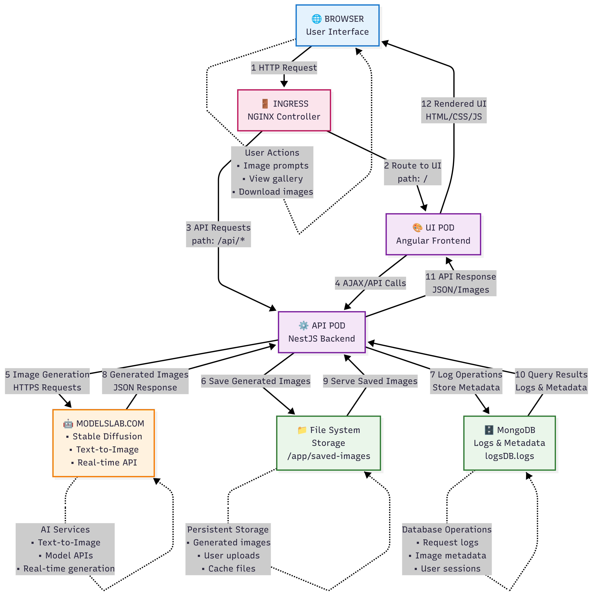
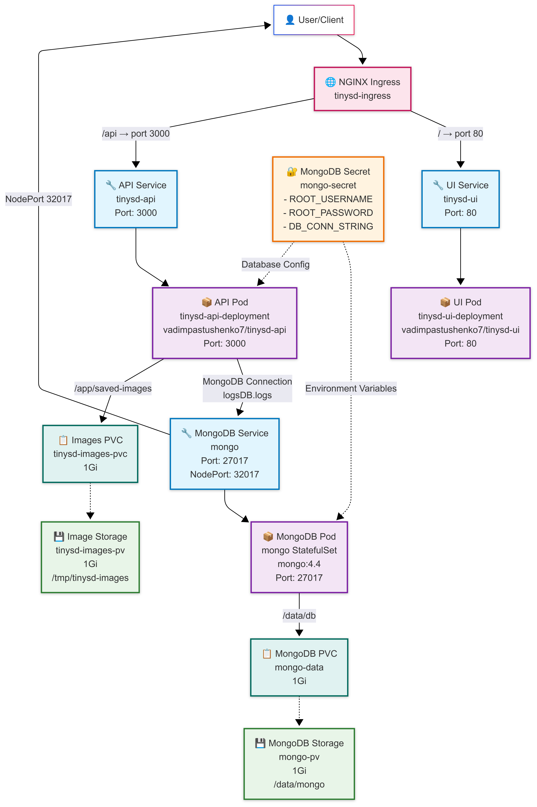
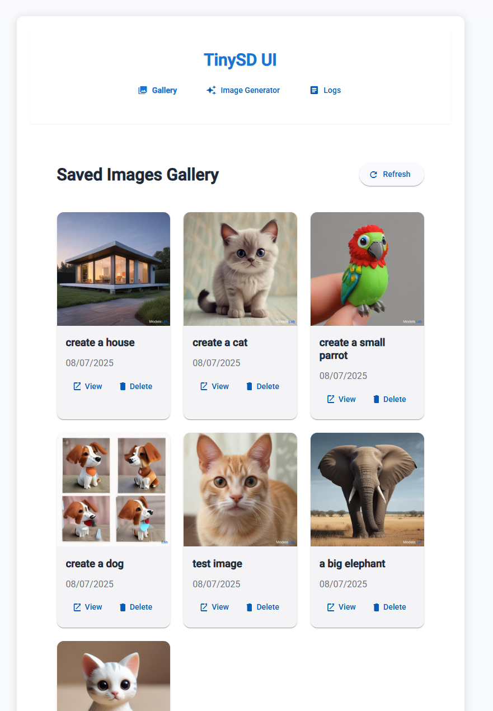

# TinySD App

This repository contains the TinySD application split into two separate projects: a NestJS API and an Angular UI. It is not an Nx monorepo.

## Architecture

- **API** (`tinysd-api`): NestJS backend application
- **UI** (`tinysd-ui`): Angular frontend application
- **Database**: MongoDB with collections for logs, images, and settings

### Application Architecture

_High-level view of the TinySD application showing the interaction between UI, API, and external services_



### Kubernetes Deployment Architecture

_Kubernetes deployment structure showing pods, services, and storage components_



### App View Gallery

_TinySD application gallery view showing saved AI-generated images_



## Development

### Prerequisites

- Node.js 20+
- npm
- Docker (for containerization)
- Kubernetes (for deployment)

### Install Dependencies

Run commands from the repository root unless noted.

```bash
# Root tooling (concurrently, kill-port)
npm install

# API dependencies
cd tinysd-api && npm install

# UI dependencies
cd ../tinysd-ui && npm install
```

### Development Servers

```bash
# Start API development server
npm run start-api

# Start UI development server
npm run start-ui

# Or start both in parallel
npm run start
```

### Build

```bash
# Build API only
npm run build-api

# Build UI only
npm run build-ui

# Production builds
npm run build-api:production
npm run build-ui:production
```

### Testing

```bash
# API tests and linting
cd tinysd-api
npm test
npm run lint

# UI tests
cd ../tinysd-ui
npm test
```

## Docker

### Build Individual Docker Images

```bash
# Build API image
docker build -t tinysd-api ./tinysd-api

# Build UI image
docker build -t tinysd-ui ./tinysd-ui
```

## Kubernetes Deployment

### Prerequisites

- Kubernetes cluster
- kubectl configured

### Deploy Database

```bash
kubectl apply -f k8s-db.yaml
```

### Deploy Application

```bash
kubectl apply -f k8s-app.yaml
```

### Example to run locally

```bash
export IMAGE_TAG=1.0.0-70-ga92d75a
envsubst < k8s-app.yaml | kubectl apply -f -
```

## Environment Variables

### API Environment Variables

- `DB_CONN_STRING`: MongoDB connection string
- `DB_NAME`: Database name (default: tinysd)
- `PORT`: API port (default: 3000)

### Setting up MongoDB Secret

The application expects a Kubernetes secret named `mongo-secret` with:

- `DB_CONN_STRING`: Base64 encoded connection string
- `DB_ROOT_USERNAME`: Base64 encoded username
- `DB_ROOT_PASSWORD`: Base64 encoded password

## Project Structure

```
tinysd-app/
├── tinysd-api/                 # NestJS API application
│   ├── src/
│   │   ├── app/
│   │   │   ├── database/       # Database connection module
│   │   │   ├── logs/           # Logging module
│   │   │   ├── image/          # Image generation module
│   │   │   └── ...
│   │   └── main.ts
│   ├── saved-images/           # Saved images storage
│   └── Dockerfile
├── tinysd-ui/                  # Angular UI application
│   ├── src/
│   │   ├── app/
│   │   │   ├── components/     # UI components
│   │   │   ├── services/       # Angular services
│   │   │   └── ...
│   │   └── main.ts
│   ├── nginx.conf
│   └── Dockerfile
├── k8s-app.yaml               # Kubernetes app deployment
├── k8s-db.yaml               # Kubernetes database deployment
└── package.json              # Root tooling scripts
```

## Features

- **Image Generation**: Generate AI images using multiple providers
- **Image Gallery**: View and manage saved images
- **Logging**: Track all application events
- **Settings Management**: Configure image generation providers
- **Kubernetes Ready**: Full K8s deployment configurations
- **Docker Support**: Development and production Docker setups

## NestJS API Migration Notes

This API was converted from Express.js to NestJS with these improvements:

## Architecture Changes

- **Modular Structure**: AppModule, DatabaseModule, LogsModule, ImageModule
- **Controllers**: LogsController, ImageController
- **Services**: LogsService, ImageService
- **DTOs**: CreateLogDto, UpdateLogDto, GenerateImageDto
- **Entities**: Log

## Key Features

- **Dependency Injection**: Services injected via constructors, global DB collections, config service
- **Validation**: class-validator decorators and validation pipe
- **Error Handling**: HTTP exceptions with status codes and structured responses
- **Configuration**: Environment variables managed via `@nestjs/config`

## API Endpoints

- `GET /api/logs`
- `GET /api/logs/:id`
- `POST /api/logs`
- `PUT /api/logs/:id`
- `DELETE /api/logs/:id`
- `POST /api/image/generate`
